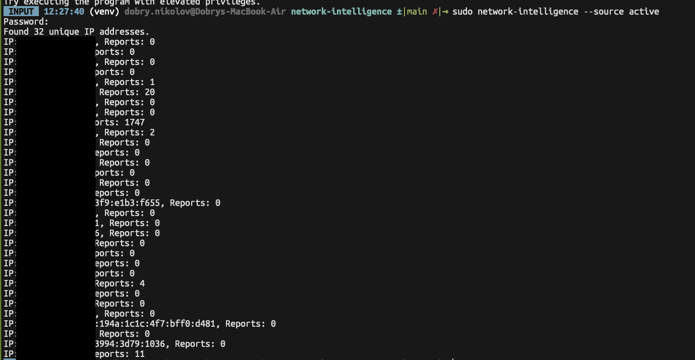
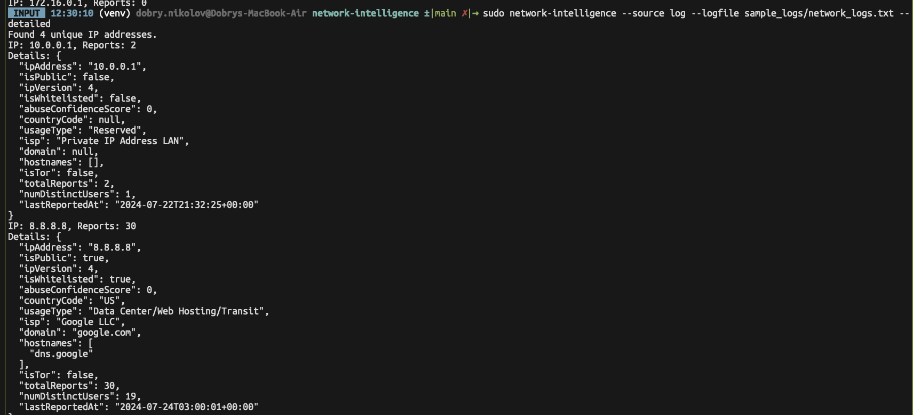
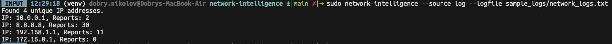

# Network Intelligence

Network Intelligence is a Python application that gathers network connection information and checks it against a threat intelligence platform.

## Installation

Clone the repository:

```sh
git clone https://github.com/yourusername/network-intelligence.git
cd network-intelligence
```

Install the package:

```sh
pip install .
```

## Configuration

### Obtain an API Key

1. Go to [AbuseIPDB](https://www.abuseipdb.com/).
2. Sign up for a free account if you don't already have one.
3. Once logged in, navigate to the [API key management page](https://www.abuseipdb.com/account/api).
4. Generate a new API key and copy it.

### Add the API Key to the Configuration

1. Encode your API key in base64:

    ```sh
    echo -n 'YOUR_ACTUAL_API_KEY' | base64
    ```

2. Copy the base64 encoded API key.
3. Open the `config.yaml` file in the project directory and add your encoded API key:

    ```yaml
    # config.yaml
    api_key: "BASE64_ENCODED_API_KEY"
    ```

## Usage

To run the application, specify the source of IP addresses:

For active connections:
```sh
sudo network-intelligence --source active
```

For connections from a log file:
```sh
network-intelligence --source log --logfile path/to/network_logs.txt
```

## Extending

To add a new threat intelligence platform, create a new connector in the `connectors` directory by extending the `BaseConnector` class and implementing the `check_ip` method.

## Screenshots





3. **Add the encoded API key to `config.yaml`:**
   - Open `config.yaml` in a text editor.
   - Replace `YOUR_BASE64_ENCODED_API_KEY` with the base64 encoded string you just generated.

   ```yaml
   # config.yaml
   api_key: "MTIzNDU2Nzg5YWJjZGVm"
   ```
